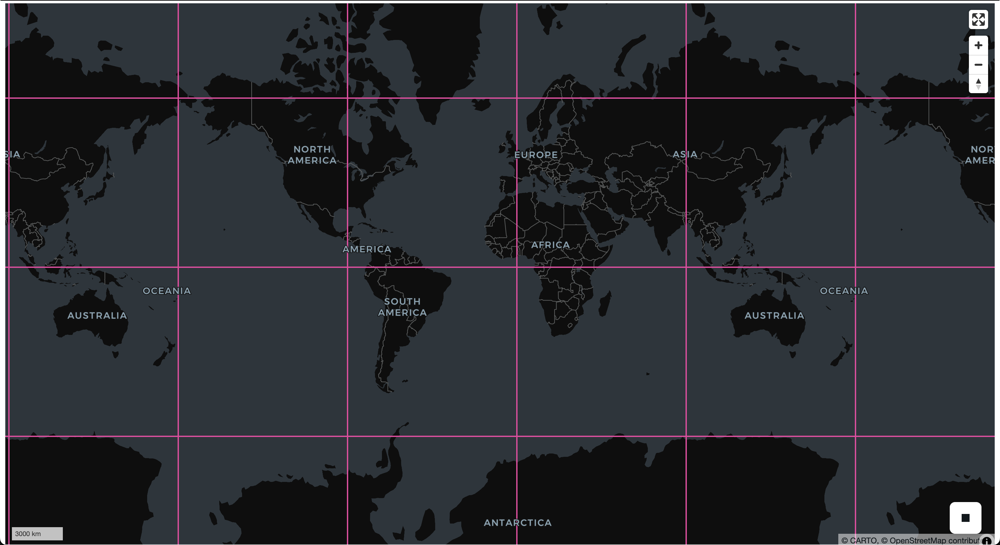

<!---
  Licensed to the Apache Software Foundation (ASF) under one
  or more contributor license agreements.  See the NOTICE file
  distributed with this work for additional information
  regarding copyright ownership.  The ASF licenses this file
  to you under the Apache License, Version 2.0 (the
  "License"); you may not use this file except in compliance
  with the License.  You may obtain a copy of the License at

    http://www.apache.org/licenses/LICENSE-2.0

  Unless required by applicable law or agreed to in writing,
  software distributed under the License is distributed on an
  "AS IS" BASIS, WITHOUT WARRANTIES OR CONDITIONS OF ANY
  KIND, either express or implied.  See the License for the
  specific language governing permissions and limitations
  under the License.
-->

# Working with Zarr and NDArray data in SedonaDB

SedonaDB's raster type is **N-dimensional**: a band isn't limited to a 2-D `(y, x)` grid — it can carry additional axes such as `time`, `year`, or `band`. This makes it a natural fit for *datacubes*: climate reanalyses, satellite time series, and model outputs.

The `sedonadb-zarr` extension reads [Zarr](https://zarr.dev/) groups (v2 or v3) — local or in cloud object storage — directly into that raster type, so a datacube becomes a table you can query.

This page walks through loading a real Zarr datacube from object storage, inspecting its dimensions, slicing out a 2-D plane, drawing its chunk grid on a map, and handing a plane to NumPy.

## Install

`sedonadb-zarr` is an extension, distributed separately from the core SedonaDB package. The examples below also use `sedonadb-expr` (which adds the `.rst` raster accessor used in the DataFrame expressions) and, for the map, `lonboard`:

```bash
pip install "apache-sedona[db]" sedonadb-zarr sedonadb-expr lonboard
```

`lonboard` is only needed for the map at the end; everything else works without it.

## Connect and load

Register the extension on your connection, then read a Zarr group. We'll use a public, anonymously readable cube: ERA5 rainfall over 2015–2020, stored as a multiscale Zarr pyramid in EPSG:3857. We read one pyramid level and the `rain_ok` rainfall array:


```python
import sedona.db
import sedonadb_zarr

sd = sedona.db.connect()
sd.register(sedonadb_zarr.ZarrExtension())

url = "https://weathermapdata.rdrn.me/era5_2015_2020_l5.zarr/2"
# The path doesn't end in `.zarr`, so name the format. `arrays` selects the
# data array to read (the group also holds coordinate / CRS variables).
spec = sedonadb_zarr.Zarr().with_options({"arrays": ["rain_ok"]})
cube = sd.read(url, format=spec)
```

When a group's path *does* end in `.zarr` and needs no options, you can name the format with the string shorthand instead: `sd.read(uri, format="zarr")`.

`sedonadb-zarr` emits **one row per Zarr chunk**, so the storage layout *is* the data layout. This level tiles its `512 × 512` grid into a `4 × 4` grid of `128 × 128` chunks, and the cube is chunked one year per chunk — so it loads as `16 × 6 = 96` rows, each a single year of one spatial tile:


```python
cube.count()
```


    96


## Inspect the dimensions

The dimension accessors read the raster's schema only — **no pixel data is loaded** — so they return near-instantly even against a large remote cube. Each row reports its **chunk's** shape, not the full cube extent. All chunks share the same shape here, so we look at one:


```python
cube.select(
    cube.raster.rst.num_dimensions().alias("ndim"),
    cube.raster.rst.dim_names().alias("dims"),
    cube.raster.rst.shape().alias("shape"),
    cube.raster.rst.dim_size("year").alias("n_year"),
).show(1)
```

    ┌───────┬──────────────┬───────────────┬────────┐
    │  ndim ┆     dims     ┆     shape     ┆ n_year │
    │ int32 ┆     list     ┆      list     ┆  int64 │
    ╞═══════╪══════════════╪═══════════════╪════════╡
    │     3 ┆ [year, y, x] ┆ [1, 128, 128] ┆      1 │
    └───────┴──────────────┴───────────────┴────────┘


Each chunk is 3-dimensional (`[year, y, x]`) with a `128 × 128` spatial footprint — one tile of the full `512 × 512` grid. `n_year = 1` because the cube is chunked one year per chunk: a single row carries one year of one tile.

## Slice out a 2-D plane

`RS_Slice` selects a single index along a named dimension and drops it. Here each chunk's `year` axis has length 1, so slicing index `0` collapses it, turning every `[1, 128, 128]` chunk into a 2-D `[y, x]` plane — the tile's rainfall field for its year:


```python
sliced = cube.select(plane=cube.raster.rst.slice("year", 0))
sliced.select(
    dims=sliced.plane.rst.dim_names(),
    shape=sliced.plane.rst.shape(),
).show(1)
```

    ┌────────┬────────────┐
    │  dims  ┆    shape   │
    │  list  ┆    list    │
    ╞════════╪════════════╡
    │ [y, x] ┆ [128, 128] │
    └────────┴────────────┘


`RS_Slice` needs pixel data, so SedonaDB resolves each row's Zarr chunk on demand before slicing — you never call a loader yourself.

Related accessors reshape a cube in other ways:

- `cube.raster.rst.slice_range(dim, start, end)` keeps a contiguous range of a dimension instead of a single index.
- `cube.raster.rst.dim_to_band(dim)` / `cube.raster.rst.band_to_dim(name)` move an axis between the dimension list and the band list.

## See where the chunks are — on a map

Every row is a chunk with a real, georeferenced footprint (the cube declares EPSG:3857), so `RS_Envelope` turns a chunk into its bounding geometry without decoding a single pixel. Reproject the footprints to lon/lat and you can draw the chunk grid straight onto a map:


```python
from lonboard import viz  # in a notebook with lonboard installed

f = sd.funcs
chunks = cube.select(geom=f.st_transform(cube.raster.rst.envelope(), "EPSG:4326"))

# Draw outlines only, so the basemap shows through the chunk grid.
viz(
    chunks,
    polygon_kwargs=dict(
        filled=False,
        stroked=True,
        get_line_color=[236, 64, 160],
        line_width_min_pixels=2,
    ),
)
```



Because each year tiles into a `4 × 4` grid, the envelopes lay out that grid over the mapped extent — a picture of the cube's layout, drawn entirely from metadata. A `LIMIT` or row filter trims which chunks you draw (and, later, fetch).

## Bring a plane into NumPy

A raster band carries its bytes, shape, and pixel type, so a materialized band decodes to a correctly-shaped, correctly-typed NumPy array in one call — `Band.to_numpy()`:


```python
planes = sliced.to_arrow_table()["plane"]
raster = planes[0].as_py()  # one 128x128 spatial tile for its year
band = raster.bands[0].to_numpy()
print(band.shape, band.dtype)
```

    (128, 128) float32


Rows correspond to chunks rather than a guaranteed order, so apply your own ordering (or carry a chunk identifier) if you need to know which tile and year a given plane covers.

## Reading from cloud storage

The same code reads a datacube over S3 or HTTP(S) — only the URI changes. Supported schemes are `file://` (and bare local paths), `s3://`, `http://`, and `https://`.

For S3, credentials come from the standard AWS environment variables (`AWS_ACCESS_KEY_ID`, `AWS_SECRET_ACCESS_KEY`, `AWS_REGION`). To read a **public** bucket anonymously, set the region and request unsigned access:

```bash
export AWS_REGION=us-west-2
export AWS_SKIP_SIGNATURE=true   # read public objects without credentials
```

```python
# A real public bucket (CarbonPlan), readable with the settings above:
df = sd.read("s3://carbonplan-share/zarr-layer-examples/antarctic_era5.zarr")
```

### Selecting arrays with the `arrays` option

By default SedonaDB discovers a group's arrays automatically — from the group's consolidated metadata when present, otherwise by listing the store. The `arrays` option names an explicit subset to read instead (as we did above):

```python
spec = sedonadb_zarr.Zarr().with_options({"arrays": ["rain_ok"]})
df = sd.read(url, format=spec)
```

Naming arrays is needed in two situations:

- **The store can't list and has no consolidated metadata.** Plain HTTP servers generally can't list directories. Cloud Zarr groups often ship a consolidated-metadata block, so reads typically work without `arrays` — but a group (or sub-group) lacking one can't be auto-discovered over such a store, and you must name the arrays.
- **The group mixes arrays with different shapes or chunk grids.** Every array read together must share one chunk grid, so name a compatible subset (for example, read the data array and leave out a differently-shaped coordinate or CRS variable).

Because each row corresponds to one chunk, a `LIMIT` or row filter directly bounds how many chunks SedonaDB fetches — handy for sampling a large remote cube before committing to a full scan.
